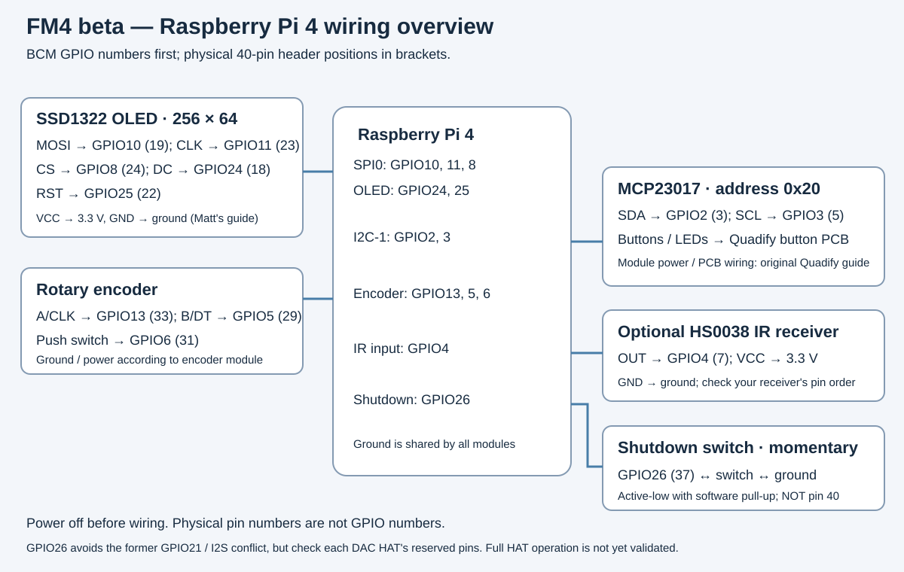

# Hardware and wiring assumed by this beta

The tested unit is a **Raspberry Pi 4B**, running piCorePlayer 11.1.0
**64-bit/aarch64**, booted from a resized USB drive. USB audio and the Pi's
Headphones output have been tested. This is not yet a claim of compatibility
with every Pi model, display, DAC HAT or IR remote.

Pi 3B/3B+ compatibility is untested; see the [Pi 3 installation note](INSTALL.md#raspberry-pi-3-compatibility).

BCM GPIO numbers below are the software names. Physical pins are positions on
the Pi's 40-pin header; do not confuse the two numbering schemes.

| Connection | BCM GPIO / bus | Physical header pin |
| --- | --- | --- |
| OLED MOSI | GPIO10 / SPI0 MOSI | 19 |
| OLED clock | GPIO11 / SPI0 SCLK | 23 |
| OLED chip select | GPIO8 / SPI0 CE0 | 24 |
| OLED DC | GPIO24 | 18 |
| OLED reset | GPIO25 | 22 |
| Encoder A | GPIO13 | 33 |
| Encoder B | GPIO5 | 29 |
| Encoder push switch | GPIO6 | 31 |
| MCP23017 SDA | GPIO2 / I2C-1 | 3 |
| MCP23017 SCL | GPIO3 / I2C-1 | 5 |
| Added shutdown switch | GPIO26, active-low | 37 |
| Optional IR receiver output | GPIO4 | 7 |

- Display: **SSD1322, 256 × 64**, SPI0 CE0. Follow Matt's original power and wiring guide.
- Buttons/LEDs: MCP23017 on I2C-1, address **0x20**, with the Quadify button-board wiring.
- IR on the tested unit: HS0038, output GPIO4, powered from 3.3 V. Confirm the
  receiver module's pin order from its datasheet; different modules may differ.
- Shutdown switch: momentary contact to ground on GPIO26, with a software pull-up.
- A CD drive is optional. USB DAC and IR receiver are optional; other panel hardware
  follows the assumed wiring above.

See [Matt's original Quadify wiring guide](https://quadify.uk/wiring.html).
Our GPIO4 IR receiver and added GPIO26 shutdown switch are port-specific additions.
Power down and disconnect power before changing wiring.

Wiring is now read from `config/hardware.json`. Set `power.gpio` to `null` to disable the shutdown input. Earlier shutdown settings remain a fallback when no explicit hardware mapping is present. See the Alpha hardware setup section below.

## DAC HATs, including IQaudio

**The current beta is not yet validated with a DAC HAT.**

IQaudio/Raspberry Pi audio HATs use I2S on GPIO18/19/20/21. Our shutdown switch uses
**GPIO26 / pin 37**, separate from those I2S signals. GPIO26 is not listed as reserved for the standard
IQaudio DAC+/DAC Pro, but it is not universally available: HiFiBerry MiniAmp
and DAC8x/ADC8x/Studio DAC8x reserve it. HiFiBerry Digi+ Pro/Digi2 Pro also conflict
with our encoder GPIO5/6; some amplifier boards reserve our IR GPIO4. Check
[HiFiBerry's exact model pin list](https://www.hifiberry.com/docs/hardware/gpio-usage-of-hifiberry-boards/).

Check the exact HAT's pin use too: optional board functions can reserve GPIOs
used by our OLED or other controls. Sharing I2C is possible only with compatible
voltage levels and distinct device addresses. A stacking/terminal HAT makes
connections accessible; it does not remove electrical pin conflicts.

The installer preserves the existing audio-output setting and existing boot
overlays, adding SPI/I2C enablement. It does not choose a DAC HAT driver. Configure
the appropriate HAT in native piCorePlayer first, then reboot. Once the wiring
and shutdown conflict have been resolved, a loaded ALSA device can appear under
**Settings → Audio Output**; seeing it listed alone does not prove full compatibility.

For this first clean-install test, use the tested USB/headphone arrangement.
HAT playback, AirPlay/Bluetooth routing, meters and volume control need a separate
hardware acceptance test before HAT support is advertised.

Source: [Raspberry Pi audio-board GPIO documentation](https://www.raspberrypi.com/documentation/accessories/audio.html#gpio-usage).

## Hardware Setup — Alpha — Not Supported — Use at own risk

**User-confirmed mapping:** encoder switch GPIO4 and IR receiver GPIO27, both working after rewiring and reboot. Other mappings and alternative hardware remain unverified. Automated checks and an unchanged-mapping browser save/restart were exercised on the developer’s unit. Existing controls were checked after the shared-configuration reboot; this does not validate changed wiring, DAC HATs or hardware recovery across different devices.

The piCore panel reads `/home/tc/sable-pcp-stage/config/hardware.json`.
Numbers are BCM GPIO numbers, not physical connector pin numbers. Missing entries use current FM4 defaults. Normal updates preserve this file. The public bundle must not contain a user's hardware.json.

The example is [hardware.example.json](hardware.example.json). On the installed device it is `config/hardware.pcp.example.json`. OLED rotation remains a display preference, separate from wiring.

Optional devices: set oled.enabled, rotary.enabled or mcp.enabled to false. Set ir.gpio or power.gpio to null for not connected; rotary.sw may also be null when the encoder has no switch. Missing OLED uses a silent headless display; disabled devices do not request GPIO/I2C/SPI resources.

Validation rejects duplicate pins, invalid BCM numbers, conflicts with the enabled SPI/I2C bus pins, and entries in reserved_gpios. This is not automatic HAT detection: enter the HAT's reserved GPIOs explicitly. Current supported buses are SPI0 CE0/CE1 and I2C1; the MCP23017 address is a JSON decimal integer 32–39.

Existing OLED/rotary/MCP wiring overrides are retained. Earlier IR-disabled and shutdown-pin settings remain defaults until the hardware configuration explicitly overrides them. Pin ownership is then controlled by hardware.json. The old standalone recovery panel is independent; the main Sable panel and its boot display use the shared configuration.

Example: to put the encoder switch on GPIO4, set rotary.sw to 4 and ir.gpio to null (or move IR to another free GPIO). Disconnect power before changing wiring. Validate before restarting the panel; malformed/conflicting configuration stops hardware startup with an error instead of silently claiming other pins.

The browser editor is available at `http://YOUR-IP/sable-hardware.html`, linked from `sable-config.html`. It is **Alpha — Not Supported — Use at own risk**. Dropdowns show GPIO and physical pin numbers; optional inputs support Not connected. Review validates the entire proposed mapping without changing files. Applying requires acknowledging the Alpha notice, saves a previous mapping, backs up piCorePlayer, then restarts the panel. Restore previous mapping is available from the same page. Failed panel startup triggers an attempt to restore and restart with the old mapping. A running process does not prove every control works: users must check their hardware after applying. Keep SSH available. The SSH wizard is still to be added.

This page does not install kernel overlays, detect DAC HATs or configure hardware wake. Reserved GPIOs are entered manually. The existing piCorePlayer LAN web interface provides access; keep it on a trusted network. Save/restore requests require a same-origin JSON POST, page token and matching configuration revision.

The single previous mapping toggles to the mapping before a restore; it is not an archive of all past configurations.
