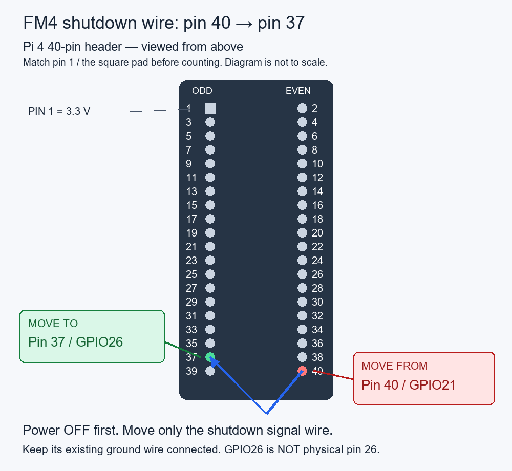

# Hardware and wiring assumed by this beta

The tested unit is a **Raspberry Pi 4B**, running piCorePlayer 11.1.0
**64-bit/aarch64**, booted from a resized USB drive. USB audio and the Pi's
Headphones output have been tested. This is not yet a claim of compatibility
with every Pi model, display, DAC HAT or IR remote.

BCM GPIO numbers below are the software names. Physical pins are positions on
the Pi's 40-pin header; do not confuse the two numbering schemes.

| Connection | BCM GPIO / bus | Physical header pin |
| --- | --- | --- |
| OLED MOSI | GPIO10 / SPI0 MOSI | 19 |
| OLED clock | GPIO11 / SPI0 SCLK | 23 |
| OLED chip select | GPIO8 / SPI0 CE0 | 24 |
| OLED DC | GPIO24 | 18 |
| OLED reset | GPIO25 | 22 |
| Encoder A | GPIO13 | 33 |
| Encoder B | GPIO5 | 29 |
| Encoder push switch | GPIO6 | 31 |
| MCP23017 SDA | GPIO2 / I2C-1 | 3 |
| MCP23017 SCL | GPIO3 / I2C-1 | 5 |
| Added shutdown switch | GPIO26, active-low | 37 |
| Optional IR receiver output | GPIO4 | 7 |

- Display: **SSD1322, 256 × 64**, SPI0 CE0. Follow Matt's original power and wiring guide.
- Buttons/LEDs: MCP23017 on I2C-1, address **0x20**, with the Quadify button-board wiring.
- IR on the tested unit: HS0038, output GPIO4, powered from 3.3 V. Confirm the
  receiver module's pin order from its datasheet; different modules may differ.
- Shutdown switch: momentary contact to ground on GPIO26, with a software pull-up.
- A CD drive is optional. USB DAC and IR receiver are optional; other panel hardware
  follows the assumed wiring above.

See [Matt's original Quadify wiring guide](https://quadify.uk/wiring.html).
Our GPIO4 IR receiver and added GPIO26 shutdown switch are port-specific additions.
Power down and disconnect power before changing wiring.

Older beta wiring used GPIO21 / pin 40. Move only that signal wire to GPIO26 /
pin 37 with power disconnected. Keep its existing ground. Rerun the installer
command before powering down to move the wire; reboot loads the updated code.
The setting `power.shutdown_gpio` can be changed in `config/pcp-settings.json`;
`null` disables the physical input. No GPIO21 fallback is used.

## DAC HATs, including IQaudio

**The current beta is not yet validated with a DAC HAT.**

IQaudio/Raspberry Pi audio HATs use I2S on GPIO18/19/20/21. Shutdown has therefore
moved to **GPIO26 / pin 37**. GPIO26 is not listed as reserved for the standard
IQaudio DAC+/DAC Pro, but it is not universally available: HiFiBerry MiniAmp
and DAC8x/ADC8x/Studio DAC8x reserve it. HiFiBerry Digi+ Pro/Digi2 Pro also conflict
with our encoder GPIO5/6; some amplifier boards reserve our IR GPIO4. Check
[HiFiBerry's exact model pin list](https://www.hifiberry.com/docs/hardware/gpio-usage-of-hifiberry-boards/).

Check the exact HAT's pin use too: optional board functions can reserve GPIOs
used by our OLED or other controls. Sharing I2C is possible only with compatible
voltage levels and distinct device addresses. A stacking/terminal HAT makes
connections accessible; it does not remove electrical pin conflicts.

The installer preserves the existing audio-output setting and existing boot
overlays, adding SPI/I2C enablement. It does not choose a DAC HAT driver. Configure
the appropriate HAT in native piCorePlayer first, then reboot. Once the wiring
and shutdown conflict have been resolved, a loaded ALSA device can appear under
**Settings → Audio Output**; seeing it listed alone does not prove full compatibility.

For this first clean-install test, use the tested USB/headphone arrangement.
HAT playback, AirPlay/Bluetooth routing, meters and volume control need a separate
hardware acceptance test before HAT support is advertised.

Source: [Raspberry Pi audio-board GPIO documentation](https://www.raspberrypi.com/documentation/accessories/audio.html#gpio-usage).
