# Start here: FM4 beta installation

This guide takes a new tester from a blank USB drive to the FM4 interface.
The base system is piCorePlayer, not Raspberry Pi OS or Volumio.
The full scripted clean installation is still being tested; keep your working
drive disconnected and intact. Do not ignore errors from the FM4 installer.

## What you need

- Raspberry Pi **4B**, with a reliable power supply and the wired FM4 panel.
- A spare USB stick or SSD. This beta expects USB partition 2 at `/mnt/sda2`
  and at least 2 GB free after resizing. SD-card layouts and Pi 5 are not validated.
- Ethernet and internet access for setup and package downloads.
  The installer also loads the native tools and firmware for onboard Raspberry Pi
  Wi-Fi. After the installation reboot, join your network through the panel's
  Wi-Fi settings or the native piCorePlayer Wi-Fi page. Keep Ethernet connected
  until a wireless IP is confirmed. Wi-Fi passwords are not supplied by us;
  USB Wi-Fi adapters may require additional model-specific firmware.
  Existing FM4 beta users can rerun the same bootstrap command to add these
  Wi-Fi dependencies; their saved network settings and Favorites are preserved.
- A Windows/Mac/Linux computer, browser and SSH terminal.
- Headphones, HDMI or a USB DAC for the initial test. DAC HATs require the
  [model-specific pin checks in HARDWARE.md](HARDWARE.md).
- Your own TIDAL/BBC accounts if you want those services. A CD drive is optional.

Check the [wiring and GPIO pinout](HARDWARE.md) first. The shutdown switch uses
**GPIO26 / physical pin 37**.

### Raspberry Pi 3 compatibility

A Pi 3B or 3B+ is a candidate for testing, rather than a confirmed supported
platform. piCorePlayer's [official Imager list](https://github.com/piCorePlayer/pCP-Releases/blob/Master/rpi-imager.json)
includes Pi 3 for the 64-bit image. We expect playback and the panel to be
feasible, but have not tested the full FM4 port on one. Spectrum responsiveness
and ripping while playing music need particular attention with less processing
and memory headroom. A 3B+ is preferable for this trial.

Use the **64-bit image** and a working USB-boot arrangement with partition 2
mounted at `/mnt/sda2`. The current installer does not support an SD-card boot
layout. USB boot must already work on your particular Pi 3 before installing.
The Pi 4B remains our tested platform.

## 1. Flash piCorePlayer 64-bit

Install [Raspberry Pi Imager](https://www.raspberrypi.com/software/).
Select your Pi model, then **Choose OS → Media Player OS → piCorePlayer →
piCorePlayer 11.1.0 64-bit**. Menu wording can vary between Imager versions;
the important choice is the **64-bit/aarch64** piCorePlayer image.

If that tested version is not listed, download it from the
[official piCorePlayer 11.1.0 release page](https://docs.picoreplayer.org/releases/pcp1110/)
and select **Use custom** in Imager. The official release page also describes
the Media Player OS menu location.

Select the spare USB drive carefully, then write and verify the image.
Configure the password and SSH in piCorePlayer's own guided setup below.
Boot the Pi with Ethernet connected. Find its assigned IP in your router's
connected-device list and open `http://YOUR-PI-IP/` in a browser.

## 2. Guided setup, with screenshots

These screenshots came from Graeme's real installation. Addresses, device names
and drive sizes are examples. Captions give the current instructions; an image
labelled **annotated example** is a teaching illustration, not a claimed live result.

### Set your system password

Enter your own password twice and click **Save**. The SSH user is **tc**.
Do not use someone else's example password.

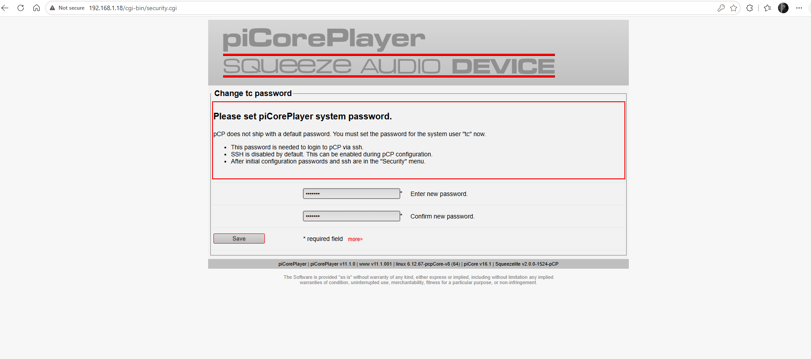

Check **Backup successful**, then click **Continue**.

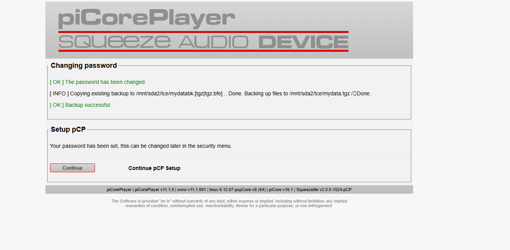

### Check updates and set a hostname

Choose **Yes** to check critical updates.

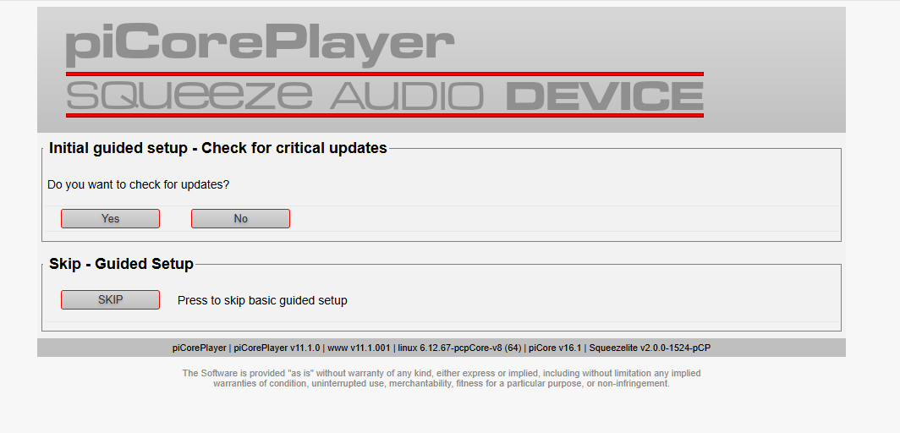

The screenshot below records an update failure while the clock showed 1970.
If this happens, continue the basic setup, fix time as described below and retry
updates. It is not permission to ignore an installer dependency error.
Choose a unique hostname using letters, digits and hyphens, then **Save**.

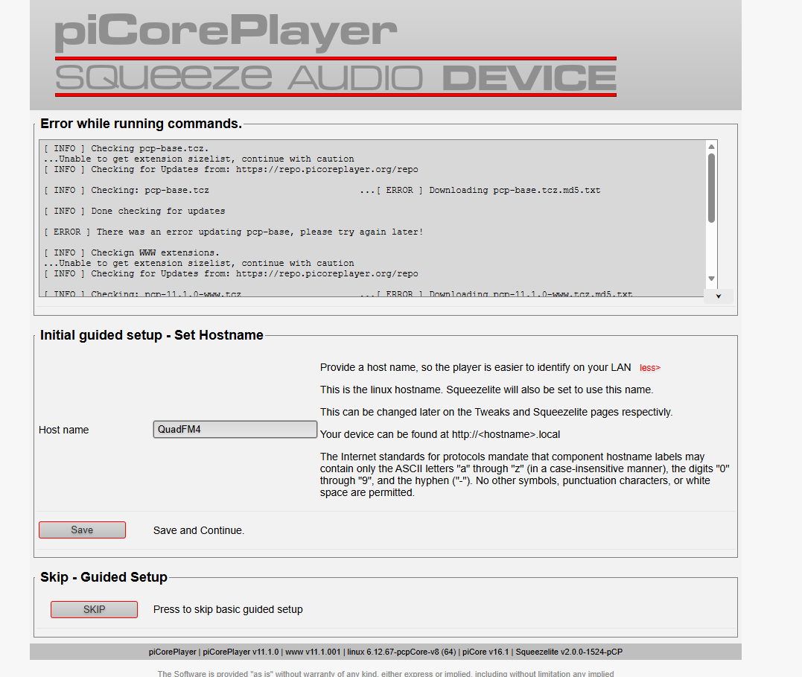

### Enable SSH

Choose **Yes**. For password login, leave **Optional SSH KEY** blank.
Connect using `tc` and the password you just set.

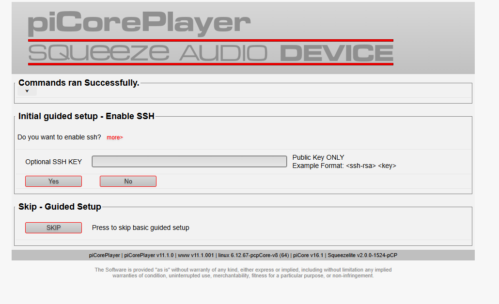

### Configure network time

Enter **pool.ntp.org**, then choose **Set and Enable**.
The original screenshot has a blank field; do not copy that blank setting.

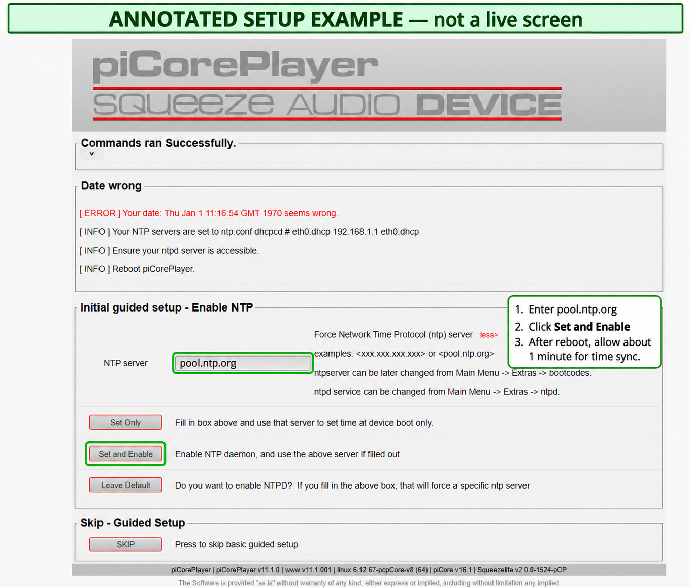

The Pi has no battery-backed clock in this tested setup. It can show 1970 just
after boot while waiting for the network and NTP. **Allow about one minute**,
refresh the page and check `date` over SSH. In our latest test the override and
daemon survived reboot and time became valid before Lyrion started.

If it still shows the wrong date after a couple of minutes, use the SSH recovery
steps below. Correct time is required before HTTPS can download the installer.

### Enable standalone server mode

Choose **Yes** when asked whether this device will be a **Lyrion Server**.

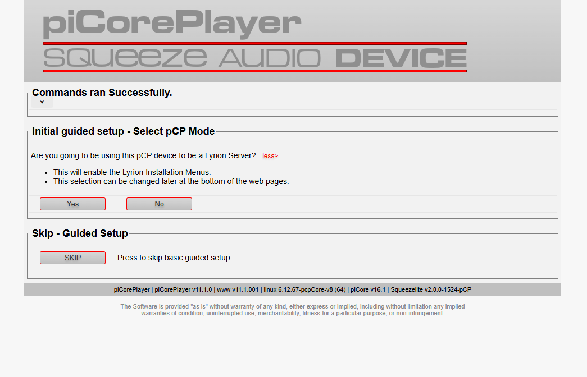

### Theme and repository

Pick **Light** or **Dark** as you prefer. Light is shown here.

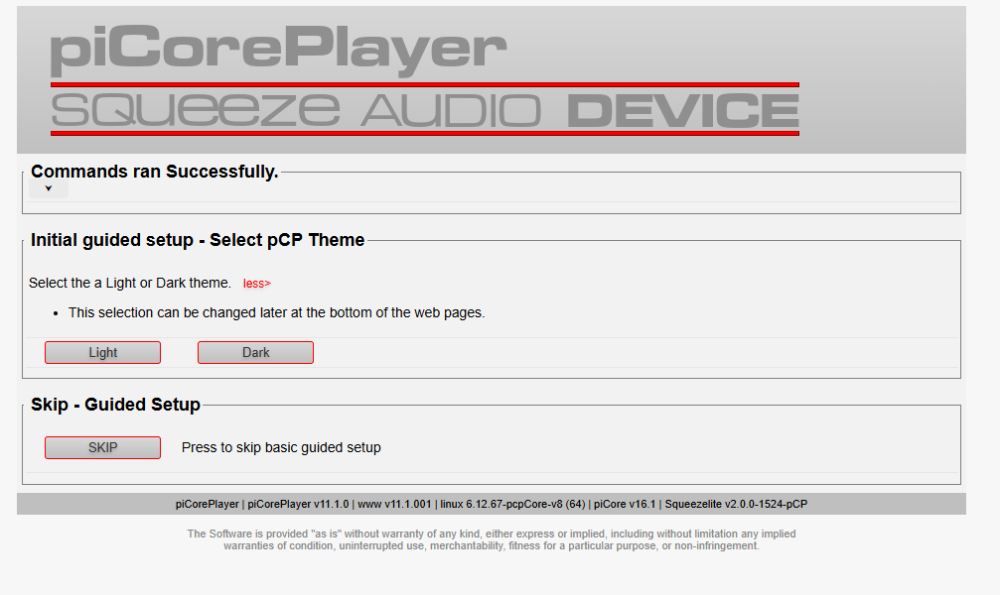

Keep the repository and click **Next**. If downloads fail after fixing time,
try an alternative native repository rather than bypassing HTTPS verification.

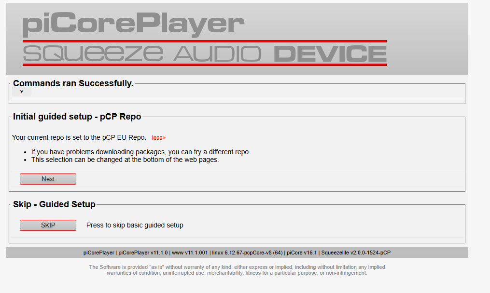

### Audio output

Choose the connected USB DAC, Headphones or HDMI output, then **Save**.
You can change this later on the OLED under **Settings → Audio Output**.

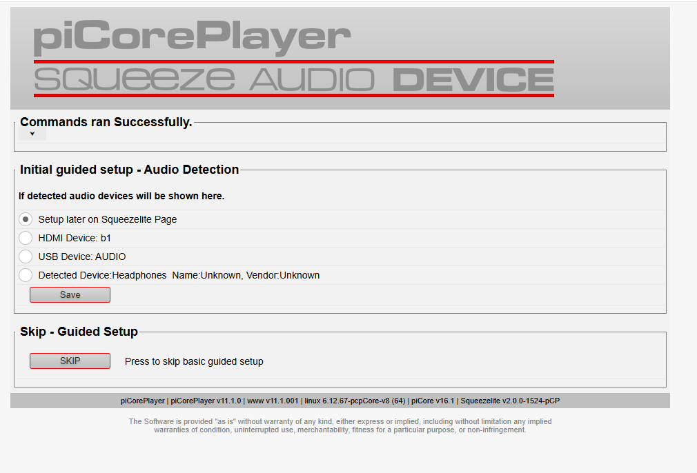

### Resize the USB drive

Choose **Resize**. The native heading says SD card even for this USB installation.

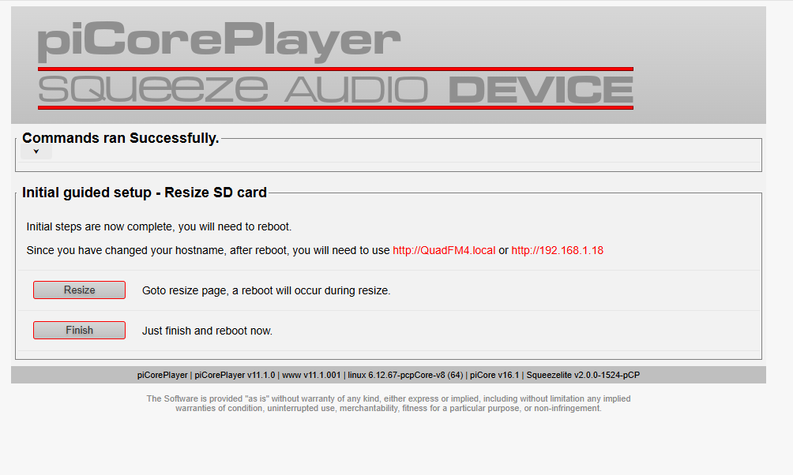

Open the **partition 2 / PCP_ROOT** size dropdown, select its **largest / bottom
option**, then click **Resize**. Leave **Add partition 3** alone for this beta.
The original screenshot below selects only about half the drive: follow this
caption and choose the full size available on your own drive.

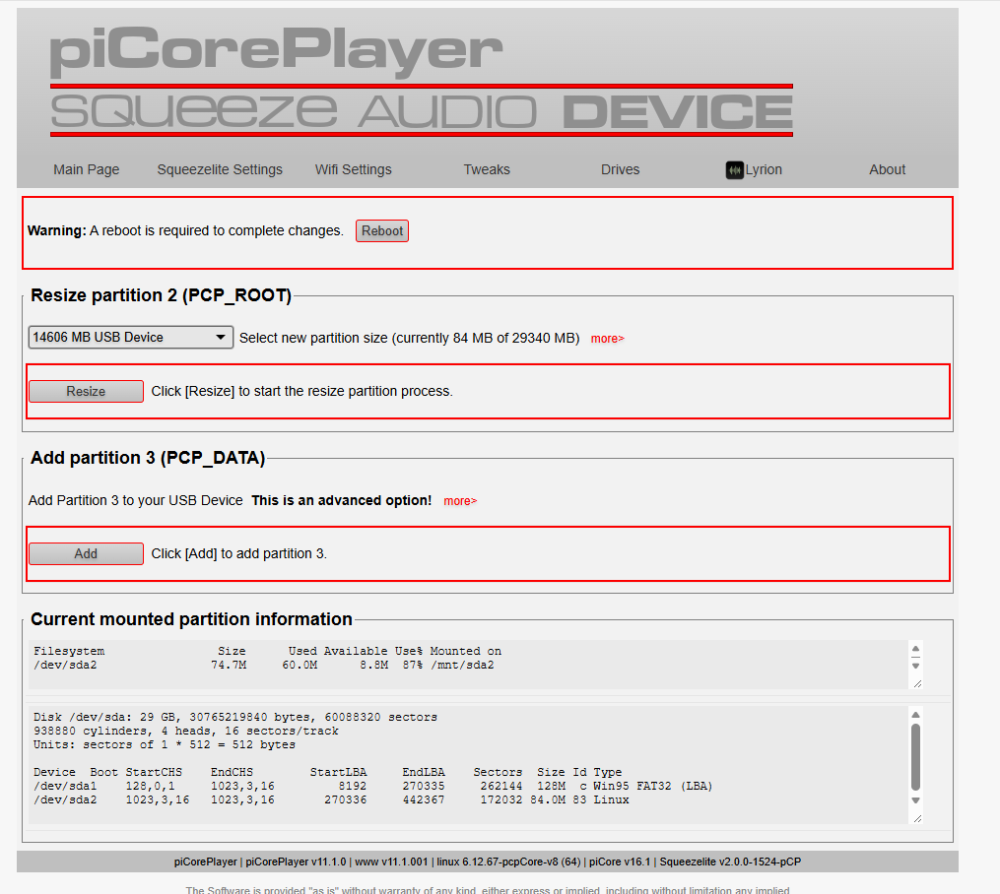

Wait for resizing and any reboots to finish. Do not remove the USB drive.
Return to **Main Page** and check the new capacity; the example size is not a target.

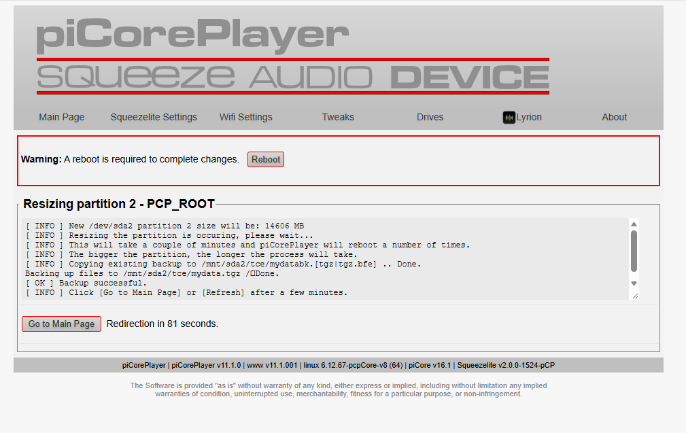

Use **Reboot**, rather than Squeezelite **Restart**, if a reboot is still required.

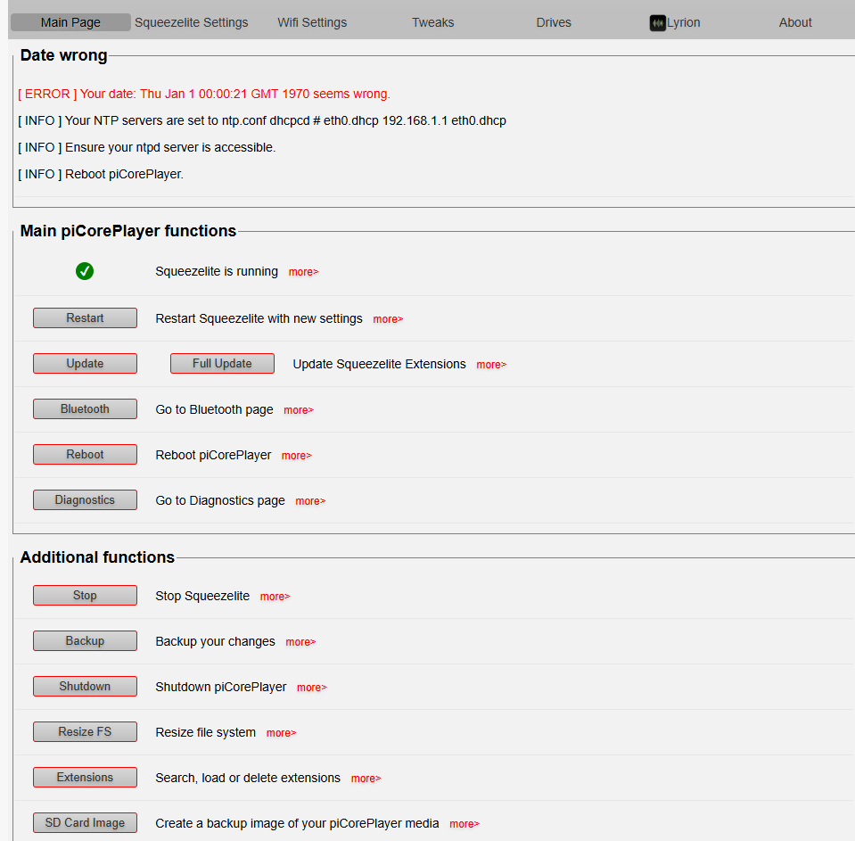

## 3. Connect by SSH and check time

On Windows, open PowerShell or Windows Terminal. On macOS/Linux, open Terminal:

```sh
ssh tc@YOUR-PI-IP
```

Accept the SSH host identity for the fresh device and enter your own password.
If you reflash the same Pi, its host key changes; do not blindly disable host
checking to get around the warning. Verify that you are connecting to your fresh Pi.

Wait about a minute after boot, then check:

```sh
date
```

If the date is still wrong, run:

```sh
sudo busybox ntpd -n -q -p pool.ntp.org
date
```

Wait for that command to finish. If it fails, check Ethernet, DNS and access to
the NTP server and retain the error. This one-off sync gets HTTPS working; the
installer saves the persistent override and enables the native NTP daemon.

## 4. Run the installer — same command twice

Paste this into the Pi's SSH session:

```sh
wget -O /tmp/fm4-bootstrap.sh https://raw.githubusercontent.com/graemedench/PiCore_FM_Empowered/main/bootstrap.sh && sudo sh /tmp/fm4-bootstrap.sh
```

The bootstrap downloads over HTTPS, verifies the bundle checksum and keeps its
files on the SSD. The first phase prepares packages, SPI/I2C and server mode.
After successful completion it asks **Reboot now? [y/N]**. Type **y** and press
Enter, or press Enter to postpone and run `pcp rb` when ready.

After reboot, allow time to sync, SSH back in and run **the identical command
again**. The second phase installs the interface and services. Wait for
**Installed** and a successful native backup. Accept the final reboot prompt.

If a step fails, save the complete terminal error and rerun the same command
after the problem is fixed. Recorded package steps are reused. Rerunning after
completion preserves personal settings and tracks and can apply beta fixes.
The installer does not import Graeme's accounts, music, Wi-Fi or private backups.

## 5. First-use checks

1. Confirm the OLED, encoder and buttons respond.
2. Open **Settings → Audio Output**, choose your attached device and play a track.
   If the DAC is missing, connect it and reopen the menu. This also sets receiver routing.
3. Open **Settings → Service URLs** for the current browser addresses. Sign into
   TIDAL and BBC Sounds using your own accounts.
4. Save a track with **button 8**. The installer creates an empty **FM4 Favorites**
   playlist; confirm your track appears in it and in the Favorites browser page.
5. **Add G's Mini Tidal List** is an optional starter playlist for testers.
6. Check shutdown with the signal wire on **GPIO26 / physical pin 37**.
7. Reboot and confirm time, settings and saved tracks return.

The [features and controls reference](CONTROLS.md) lists short/long presses,
display modes, CD ripping, Wi-Fi and remote learning.

## Addresses and music files

Replace `YOUR-PI-IP` with your device's actual address. The OLED's Service URLs
uses the current IP; these are templates, not literal browser hostnames.

| Page | Address |
| --- | --- |
| piCorePlayer setup | `http://YOUR-PI-IP/` |
| Web player | `http://YOUR-PI-IP:9000/` |
| TIDAL settings | `http://YOUR-PI-IP:9000/plugins/TIDAL/settings.html` |
| BBC Sounds settings | `http://YOUR-PI-IP:9000/plugins/BBCSounds/settings/basic.html` |
| FM4 Favorites | `http://YOUR-PI-IP/fm4-favorites.html` |
| Server settings | `http://YOUR-PI-IP:9000/settings/server/basic.html` |
| Windows Music share | `\\YOUR-PI-IP\Music` |

Copy your own music into the Music share, then scan for new music in Lyrion.
CD rips appear inside **CD Rips**, organised by artist/album when metadata is available.
This beta's share is writable guest SMB2; Windows 11 may block guest access or
require signing. Prefer reviewing your Windows settings rather than enabling SMB1.
CD and remote hardware are optional. Beta remote learning recognises the current
32-bit IR format and is not a promise that every remote will work.

## What to test and report

Python dependencies and install tools are stored under `/mnt/sda2/FM4 Runtime`,
with links from the panel's usual paths, to keep piCorePlayer's settings backup
small. Preserve this directory when cloning the disk; `mydata.tgz` alone is a
settings backup and does not contain the complete application dependency tree.

- Both phases finish without manual file repairs; keep any failure output.
- Time recovers after boot; audio output selection and transport controls work.
- TIDAL/BBC use your accounts; Favorites and settings survive reboot.
- SMB copying and local-library scanning work without indexing streaming albums.
- AirPlay/Bluetooth play and hand back to normal playback; meters work.
- No-drive startup works. If a CD drive is available, try playback and FLAC/MP3 rip.
- Try display modes, remote learning and GPIO26 shutdown.
- Check that an installer rerun preserves your preferences and playlist.

Based on [Matt's original Sable](https://github.com/theshepherdmatt/sable),
[Quadify wiring](https://quadify.uk/wiring.html) and
[Quadify Empowered](https://github.com/graemedench/quadify_empowered).
Graeme and Alex (OpenAI Codex) vibe-coded this port: Graeme guided and tested
the hardware; Alex did the implementation and integration work. Original rights
and notices remain applicable.
